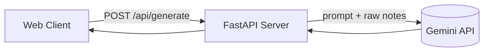

# Client Proposal Generator — Engineering Design Doc

**Author:** TBD
**Status:** Draft v0.2
**Last updated:** 2026-07-23
**Reviewers:** TBD

---

## 1. Summary

We are building a single-page web application that converts unstructured client discovery notes into a structured client proposal. The system consists of a vanilla HTML/JS/CSS frontend and a lightweight Python backend serving a single API endpoint that calls the Gemini LLM. The most interesting engineering choice is requesting structured JSON containing estimated project hours, then dynamically calculating the final price on the frontend/backend using a fixed rate of $100/hour.

## 2. Assumptions

- **Target scale:** <1k DAU in v1.
- **Latency budget:** p95 <5s end-to-end.
- **Platform:** Desktop-first web app.
- **Cost ceiling:** <$0.01 per generation.
- **Out of scope:** Auth, DB storage, dynamic currencies, dynamic rates.

## 3. Goals & non-goals

**Goals (v1):**
- Accept large unstructured text inputs (up to ~10,000 characters).
- Return a structured proposal JSON containing title, summary, deliverables, timeline, and estimated hours.
- Perform price calculation on the backend/frontend dynamically at $100/hr.

**Non-goals (v1):**
- Auth, multi-user accounts, saving history.
- Changing hourly rate via the UI (fixed to $100/hr).

## 4. Architecture



**What's here:**
- Vanilla JS Client — Handles UI state and animations.
- FastAPI Server — Proxies requests to Gemini, validates JSON structure.
- Gemini API — Extracts features and outputs proposal JSON.

## 5. Key components

### FastAPI Server (`main.py`)
- **Responsibility:** Receive text, construct prompt, call Gemini, calculate final pricing, return JSON.
- **Tech choice:** Python / FastAPI.
- **Interface:** Exposes `POST /api/generate`.

### Gemini Client Integration
- **Responsibility:** LLM inference.
- **Tech choice:** `google-genai` SDK using `gemini-3.6-flash`.

## 6. Data model

```typescript
// The JSON payload returned from the backend
type Proposal = {
  title: string;
  summary: string;
  deliverables: string[];
  timeline: { phase: string; duration: string }[];
  estimatedHours: number;
  totalPrice: number; // calculated as estimatedHours * 100
};
```

## 7. API surface

### `POST /api/generate`

- **Input:** `{ "notes": "string (max 10k chars)" }`
- **Output:** The `Proposal` schema defined above.
- **Errors:** 
  - `400 Bad Request` if notes are empty or too long.
  - `500 Internal Server Error` if LLM fails.
- **Latency budget:** p95 <5s.

## 8. Key trade-offs (with rejected alternatives)

### Decision: Price Calculation Location
- **Chose:** Calculate the total price (`estimatedHours * 100`) on the backend and return it in the payload.
- **Considered:** Frontend calculation.
- **Why we picked this:** Keeps business logic centralized in the backend. If the rate changes to $120/hr in the future, only backend config updates are needed.

## 9. Risks & unknowns

- **Risk:** Gemini estimates unrealistic development hours. — Likelihood: Med — Mitigation: System prompt instructs the model to be realistic, grounding estimations against historical averages for standard tasks.

## 10. Testing strategy

**Unit tests (must have):**
- `validate_input()` — Rejects payloads >10k chars and empty payloads.
- `calculate_pricing()` — Verifies that for $H$ estimated hours, the price is exactly $H \times 100$.

**Integration tests (one per happy path):**
- `test_generate_proposal_flow` — Mocks Gemini response and verifies a structured proposal is returned.

**Deliberately not tested (and why):**
- UI transitions and copywriting.

**Stack defaults:**
- Python → `pytest`

## 11. Rollout & monitoring
Standard FastAPI deployment.

## 12. Cost & capacity
Fixed costs associated with Gemini API usage.

## 13. Open questions
None.

## 14. Out of scope (will not do)
Same as product.md.
